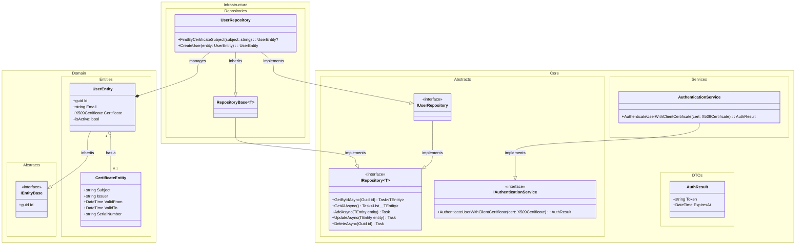

# DCD

## Metadata
| Element     | Description |
|-------------|-------------|
| Title       | Data Class Diagram |
| Cross References | [Domain model][DM] [Use Cases 001][UC001-DCD]  |

## Diagram

<!-- Links to other documentation files can be added here using the following syntax: -->
[DM]: https://github.com/TirsvadWeb/DotNet.Portfolio/blob/main/docs/DomainModel.md
[UC001-DCD]: https://github.com/TirsvadWeb/DotNet.Portfolio/blob/main/docs/UseCases/UC001/Artifacts.md#dcd