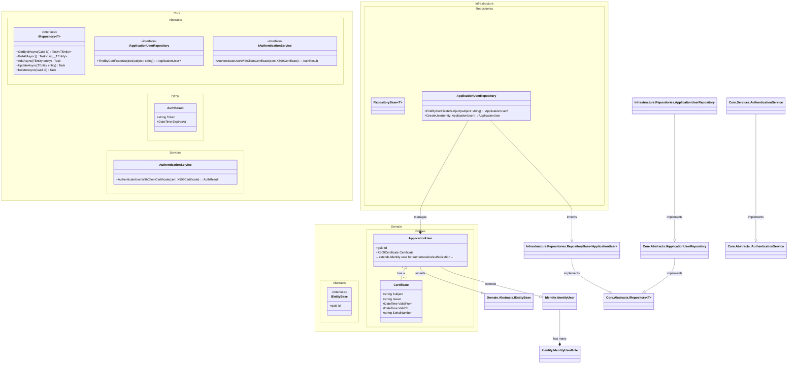

# DCD

## Metadata
| **ID** | **Description** | Cross Reference links |
|--------|-----------------|-----------------------|
| DCD-001 | Data Class Diagram | [Domain model][DM] [Use Cases 001][UC001-DCD]   |

## Diagram

### User Authentication with Client Certificate - Data Class Diagram

### Microsoft Identifier - Data Class Diagram

[microsoft-identity-abstractions-for-dotnet]

<!-- Links to other documentation files can be added here using the following syntax: -->
[DM]: https://github.com/TirsvadWeb/DotNet.Portfolio/blob/main/docs/DomainModel.md
[UC001-DCD]: https://github.com/TirsvadWeb/DotNet.Portfolio/blob/main/docs/UseCases/UC001/Artifacts.md#dcd

[microsoft-identity-abstractions-for-dotnet]: https://github.com/AzureAD/microsoft-identity-abstractions-for-dotnet/blob/main/README.md#concepts "Microsoft Identity Abstractions for .NET"
