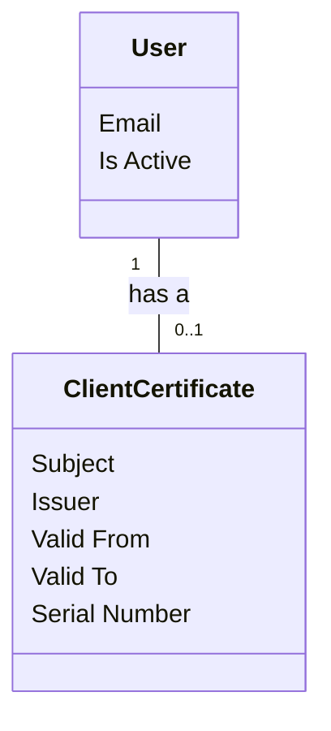

# Domain Model
A conceptual representation of the main entities and their relationships within the system for all use cases.

## Metadata
| Element     | Description |
|-------------|-------------|
| ID          | 000-DM      |
| Title       | Domain Model |
| Cross References | [Use Cases 001][UC001-DM]  |

## Diagram

<!-- Links -->
[UC001-DM]: https://github.com/TirsvadWeb/DotNet.Portfolio/blob/main/docs/UseCases/UC001/Artifacts.md#domain-model