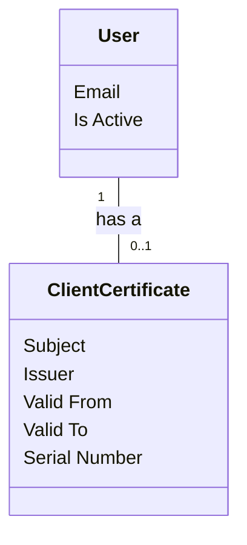

# Domain Model
A conceptual representation of the main entities and their relationships within the system for all use cases.

## Metadata
| **ID** | **Description** | Cross Reference links |
|--------|-----------------|-----------------------|
| DM-001 | Domain Model    | [Use Cases 001][UC-001-DM]  |

## Diagram

<!-- Links -->
[UC-001-DM]: https://github.com/TirsvadWeb/DotNet.Portfolio/blob/main/docs/UseCases/UC001/Artifacts.md#domain-model
