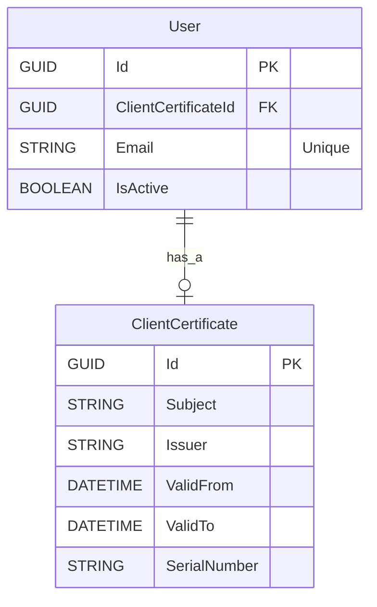

# Entity-Relationship Diagram
## Metadata
| Element     | Description |
|-------------|-------------|
| Id          | 000-ERD     |
| Title       | Entity-Relationship Diagram |
| Cross References | [Domain model][DM] [Use Cases 001 ERD][UC001-ERD]  |

## Diagram

---
<!-- Links -->
[DM]: https://github.com/TirsvadWeb/DotNet.Portfolio/blob/main/docs/ER.md
[UC001-ERD]: https://github.com/TirsvadWeb/DotNet.Portfolio/blob/main/docs/UseCases/UC001/Artifacts.md#er-diagram
