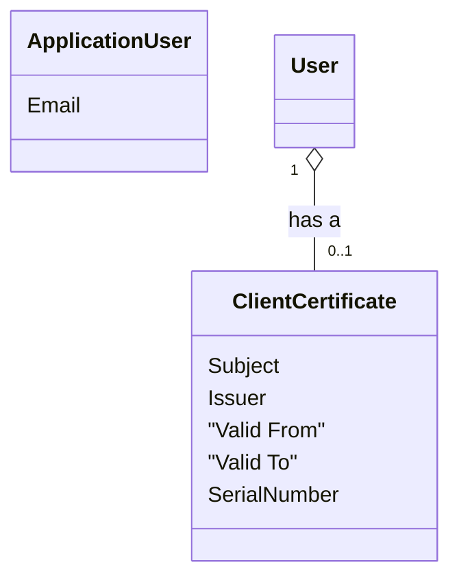
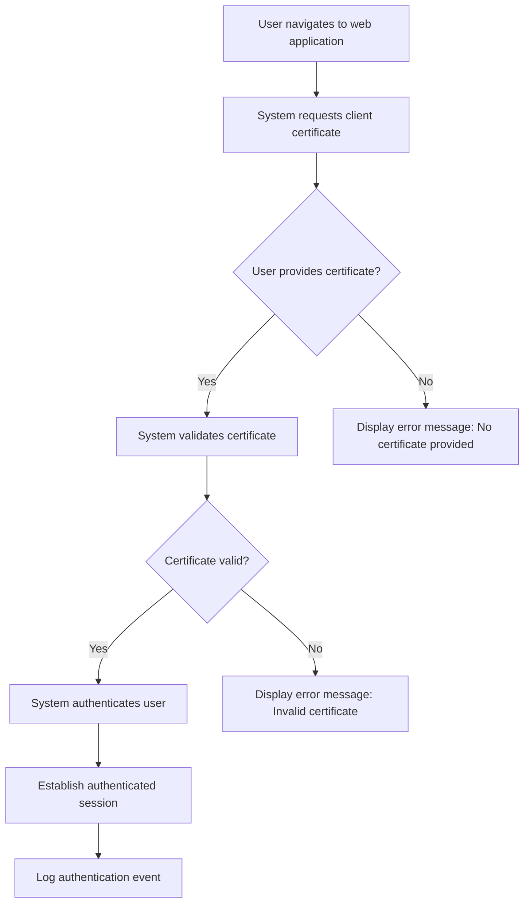
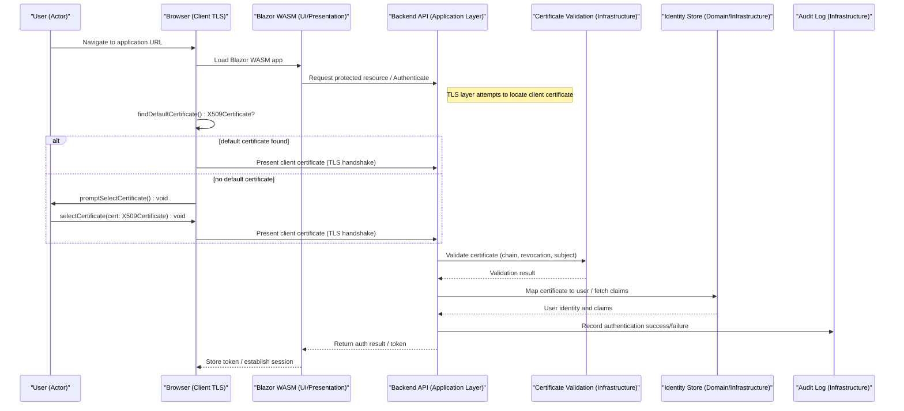
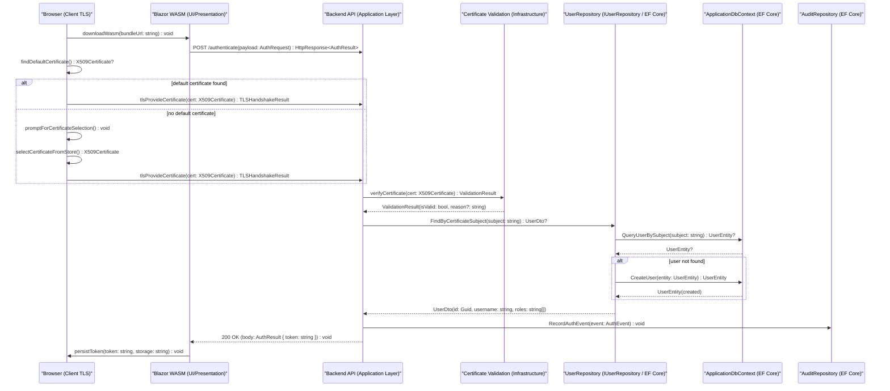
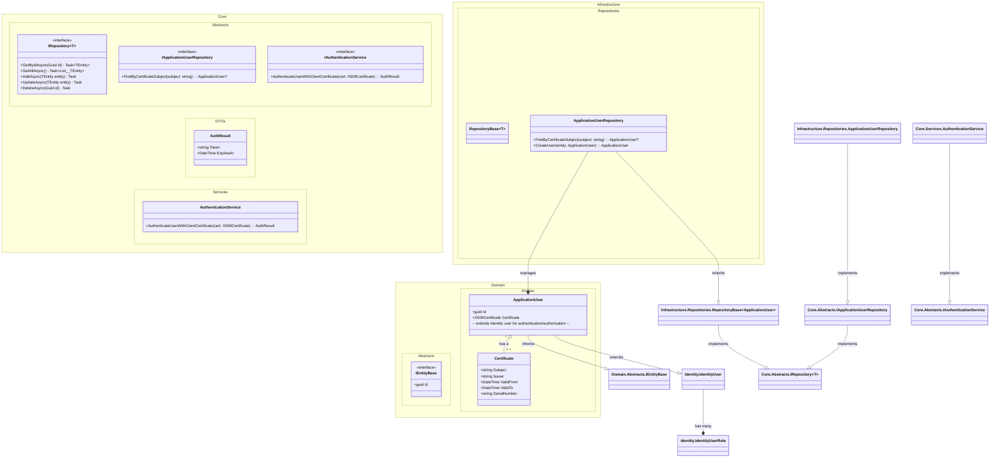
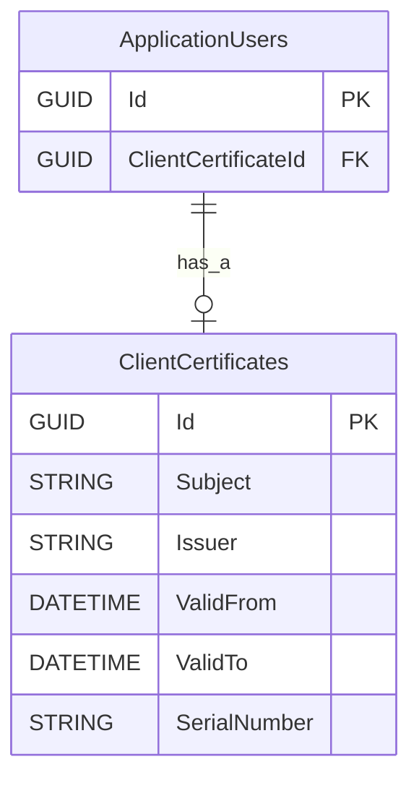

# Use Case 1 - Sign in using a client certificate
A detailed use case documentation for "Sign in using a client certificate" authentication method in a web application.
It is intended to provide a comprehensive understanding of the use case, including the domain model, user story, use case brief, system sequence diagram, operations contracts, sequence diagram, domain class diagram (DCD), and entity-relationship (ER) diagram.

## Table of Contents
- [User Story](#user-story)
- [Domain Model](#domain-model)
- [Use Case Brief](#use-case-brief)
  - [Primary Actor](#primary-actor)
  - [Stakeholders and Interests](#stakeholders-and-interests)
  - [Preconditions](#preconditions)
  - [Postconditions](#postconditions)
  - [Main Success Scenario](#main-success-scenario)
  - [Non-functional requirements](#non-functional-requirements)
  - [Notes](#notes)
- [Use Case Casual](#use-case-casual)
- [System Sequence Diagram](#system-sequence-diagram)
- [Operations Contracts](#operations-contracts)
- [Sequence Diagram](#sequence-diagram)
- [DCD](#dcd)
- [ER Diagram](#er-diagram)
- [Related artifacts](#related-artifacts)

---

## Metadata

| **ID** | **Description** | Cross Reference links |
|--------|-----------------|-----------------------|
| UC-001 | Sign in using a client certificate | [Domain Model][DM] [DCD][DCD] [System Sequence Diagram](#system-sequence-diagram) [Operations Contracts](#operations-contracts) [Sequence Diagram](#sequence-diagram) [ER Diagram](#er-diagram) |

| Element     | Description |
|-------------|-------------|
| Level       | User Goal   |

---

## User Story
As a user, 
I want to sign in to a web application using a client certificate
so that I can securely authenticate without using a password.

---

## Domain Model
This is a initial version of the Domain Model for the use case "Sign in using a client certificate". It captures the key entities, their attributes, and relationships relevant to the authentication process using client certificates.
The maintained Domain Model can be found [here][DM].

### Metadata

| **ID** | **Description** | Cross Reference links |
|--------|-----------------|-----------------------|
| UC-001-DM | Sign in using a client certificate - Domain Model | [User Story](#user-story) [DCD](#dcd) [ER Diagram](#er-diagram) |

### Diagram

---

## Use Case Brief
### Metadata

| **ID** | **Description** | Cross Reference links |
|--------|-----------------|-----------------------|
| UC-001-B | Sign in using a client certificate - Brief | [User Story](#user-story) [TR-001][TR-001] |

### Primary Actor
- User

### Stakeholders and Interests
- **User:** Wants a secure and convenient way to authenticate.
- **Web Application Owner:** Wants to ensure secure access to the application.
- **Regulatory Authorities:** Wants to ensure that authentication methods comply with data protection regulations.

### Preconditions
- The user has a valid client certificate issued by a trusted certificate authority.
- Optional: The user has a valid self-signed client certificate if the application supports it.
- The web application is configured to accept client certificate authentication.
- The user has installed the client certificate in their browser or operating system.

### Postconditions
- The user is authenticated and granted access to the web application.
- Optional: An audit log entry is created for the authentication event.

### Main Success Scenario
1. User navigates to the web application.
2. System requests a client certificate from the user's browser/OS.
3. User selects and sends a valid client certificate.
4. System validates the certificate chain, revocation status, and matching subject (or mapped account).
5. System authenticates the user and establishes an authenticated session.
6. System logs the authentication event (audit entry).

### Non-functional requirements
- The authentication process should complete within 3 seconds.

### Notes
- Client certificate authentication enhances security by eliminating the need for passwords, reducing the risk of phishing attacks.

---

## Workflow Diagram

---

## Use Case Casual

This casual (alternate) use case describes the two main outcomes when a user attempts to authenticate with a client certificate: success or failure.

### Metadata

| **ID** | **Description** | Cross Reference links |
|--------|-----------------|-----------------------|
| UC-001-C | Sign in using a client certificate - Casual | [Use Case Brief](#use-case-brief) [System Sequence Diagram](#system-sequence-diagram) |

### Primary Flow — Successful Authentication
1. User navigates to the web application.
2. System requests a client certificate from the user's browser/OS.
3. User selects and sends a client certificate.
4. System validates the certificate chain, revocation status, and matching subject (or mapped account).
5. System authenticates the user and establishes an authenticated session.
6. System logs the authentication event (audit entry).

Postconditions:
- User is granted access to authorized resources.
- An audit log entry is recorded.

### Alternate Flow — Failed Authentication (invalid/no certificate)
4a. System requests a client certificate from the user's browser/OS.
  1. User either does not provide a certificate or provides an invalid/expired/revoked certificate.
  2. System denies authentication and displays an error message with next steps (e.g., instructions to install a certificate or contact support).

Postconditions:
- User is not authenticated.
- Authentication failure is recorded in audit logs and, if configured, triggers alerting for repeated failures.

### Exceptions and Notes
- If certificate validation services (CRL/OCSP/OCSP stapling) are unavailable, system should follow a defined fail-safe policy (e.g., deny access or allow with restricted privileges) and record the condition for investigation.
- For locked or blocked accounts, the system should surface guidance for remediation (account unlock, certificate re-issuance).
- Provide clear user-facing guidance to reduce support calls (how to install certificates, supported browsers/OS).

---

## System Sequence Diagram
### Metadata
| **ID** | **Description** | Cross Reference links |
|--------|-----------------|-----------------------|
| UC-001-SSD | Sign in using a client certificate - System Sequence Diagram | [Use Case Brief](#use-case-brief) [System Sequence Diagram](#system-sequence-diagram) |

### Diagram

---

## Operations Contracts
### Metadata
| **ID** | **Description** | Cross Reference links |
|--------|-----------------|-----------------------|
| UC-001-OC | Sign in using a client certificate - Operations Contracts | [System Sequence Diagram](#system-sequence-diagram) |

| Element     | Description |
|-------------|-------------|
| Operation | `AuthenticateUserWithClientCertificate()` |
| Preconditions | - User has a valid client certificate installed in their browser/OS. - System is configured to accept client certificate authentication. |
| Postconditions | - The user is authenticated and granted access to the web application. - An audit log entry is created for the authentication event. |

---

## Sequence Diagram
### Metadata
| **ID** | **Description** | Cross Reference links |
|--------|-----------------|-----------------------|
| UC-001-SD | Sign in using a client certificate - Sequence Diagram | [Use Case Brief](#use-case-brief) [System Sequence Diagram](#system-sequence-diagram) |

### Diagram

---

## DCD
Domain Class Diagram (DCD) for the use case "Sign in using a client certificate".
It captures the key entities, their attributes, and relationships relevant to the authentication process using client certificates.
The solution DCD can be found [here][DCD-001].

### Metadata
| **ID** | **Description** | Cross Reference links |
|--------|-----------------|-----------------------|
| UC*001-DCD | Sign in using a client certificate - Domain Class Diagram | [Domain Model](#domain-model)  |

### UC001 Domain Class Diagram
This diagram shows the application domain entities and how they integrate with the Identity model for the UC-001 use case.

### Diagram Indentity Model
[microsoft-identity-abstractions-for-dotnet]

---

## ER Diagram

### Metadata
| **ID** | **Description** | Cross Reference links |
|--------|-----------------|-----------------------|
| UC-001-ERD | Sign in using a client certificate - ER Diagram | [Domain Model](#domain-model) [DCD](#dcd) |

### Diagram

**Notes**:

`ApplicationUsers` is a extended `IdentityUser` table to store user information.

---

## Glossary

### Related artifacts

| Element     | From | New Element | To | Description |
|-------------|------|-------------|----|-------------|
| User        | UC-001-DM | ApplicationUser | UC001-DCD | Represents the user entity in the system. |

---

<!-- Links to related artifacts -->
[TR-001]: ../../RiskAnalysis.md#technical-risk
[OR-001]: ../../RiskAnalysis.md#operational-risk
[LCR-001]: ../../RiskAnalysis.md#legal-and-compliance-risk
[DCD-001]: ../../DCD.md
[DM-001]: ../../DomainModel.md

[microsoft-identity-abstractions-for-dotnet]: https://github.com/AzureAD/microsoft-identity-abstractions-for-dotnet/blob/main/README.md#concepts "Microsoft Identity Abstractions for .NET"
