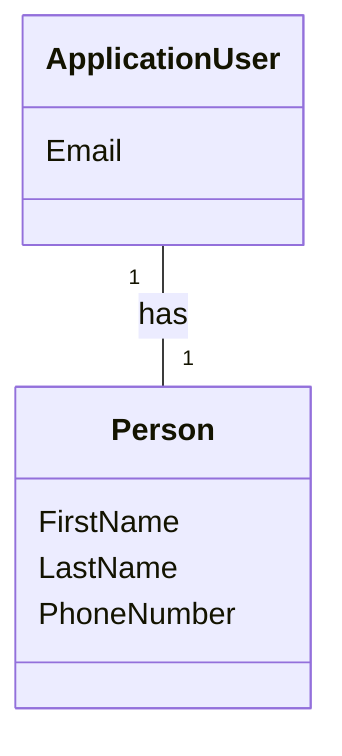

# Use Case 2 - View and edit basic profile
A detailed cuse case documentation for "View and edit basic profile".
It is intended to provide a comprehensive understanding of the use case, including the domain model, user story, use case brief, system sequence diagram, operations contracts, sequence diagram, domain class diagram (DCD), and entity-relationship (ER) diagram.

---

## Metadata
| **ID** | **Description** | Cross Reference links |
|--------|-----------------|-----------------------|
| UC-002 | View and edit basic profile | [Link to User Story](#user-story) |

| Element     | Description |
|-------------|-------------|
| Level       | User Goal   |

---

## User Story
As a registered user,  
I want to view and edit my basic profile information   
so that I can keep my account details up to date.

---

## Domain Model

### Metadata

| **ID** | **Description** | Cross Reference links |
|--------|-----------------|-----------------------|
| UC-001-DM | Domain Model for View and edit basic profile | [Link to User Story](#user-story) |

### Diagram

---
